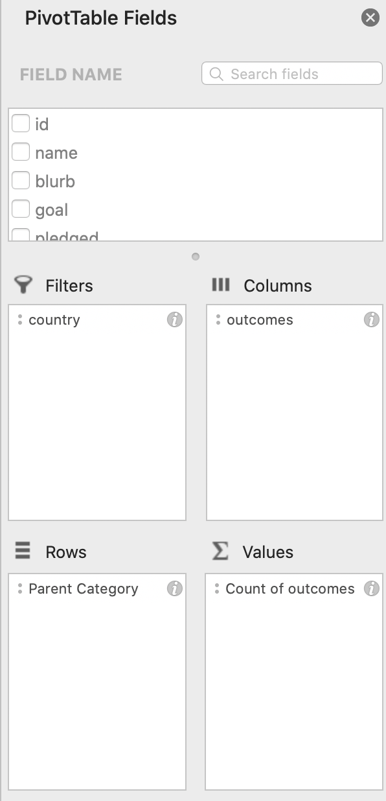
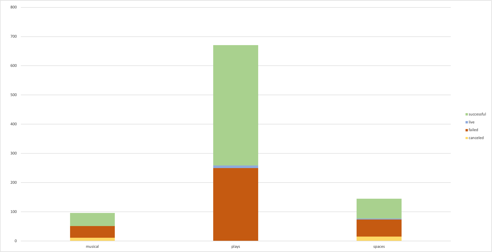
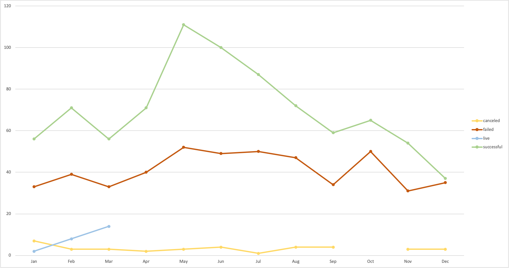

# A Focused Analysis of Theater-based Kickstarter Campaigns

## Overview and Purpose of Project

This project focused on performing analysis on Kickstarter data to uncover trends in theater-based crowdfunding campaigns. The requester was "Louise," someone who was considering starting her own crowdfunding campaing to support a play they were producing. The primary tool used was Microsof Excel. The source data was a table of 4114 campaigns from 2010 through 2017, sourced with a bias towards theater campaigns, but sampling from a range of other categories as well. The methods used included pivot tables, break-out tables of subsets of data, charts of various critera, and various statistical formulae.

## Analysis and Challenges

The majority of the analysis conducted in this excercise was performed through pivot tables and graphs based on those tables. 

Pivot tables, while being a wonderfully powerful tool, can be a bit of a challenge to get used to. In setting up the criteria, it can be confusing to know which value you want to set as columns, rows, filters, and values. Sometimes it is necessary to stumble through settings until the table shows you the information you're looking for in a way that makes logical sense.

Our table for 'Outcomes Based on Goals' was built from formulae.  

## Know your chances

Out of over 900 US-based theater-related Kickstarter campaigns, over half were successfully funded, with just over one-third failures (did not meet fundraising goals).

Out of the 671 campaigns for plays, over 60% were successful, also with roughly one-third failures.

What this shows is that overall odds are good for the sucess of theater-related kickstarter projects, though they are not guaranteed. There is still a non-negligible risk of failure. That said, let's look at another factor that could contribute to the success of a crowdfunding campaign.

## The Right Timing

The above chard shows the number of theater-related Kickstarter campaigns, differentiated by outcome, charted by the month in which they were launched. As one can see, most sucessful campaigns are launched in May or June. It is also apparent that the highest likelihood of failure occurs with campaigns launched in December or January. The safe assumption is that a large number of Kickstarter's customer-base/audience are probably focused at that time of year on saving their money for holiday shopping or end-of-the-year expenses.

### Analysis of Outcomes Based on Launch Date

### Analysis of Outcomes Based on Goals

### Challenges and Difficulties Encountered

## Results

- What are two conclusions you can draw about the Outcomes based on Launch Date?

- What can you conclude about the Outcomes based on Goals?

- What are some limitations of this dataset?

- What are some other possible tables and/or graphs that we could create?

# A Focused Analysis of Theater-based Kickstarter Campaigns
### Module 1 of UCB Data Analysis Bootcamp

## Overview

## Setting good goals

## UK Plays & Musicals

